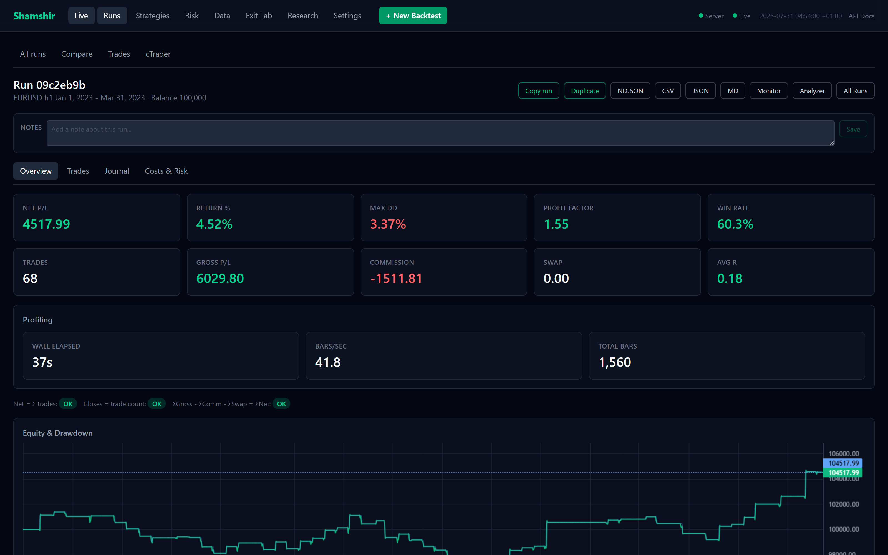
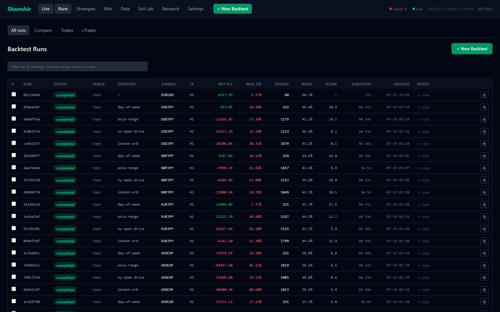
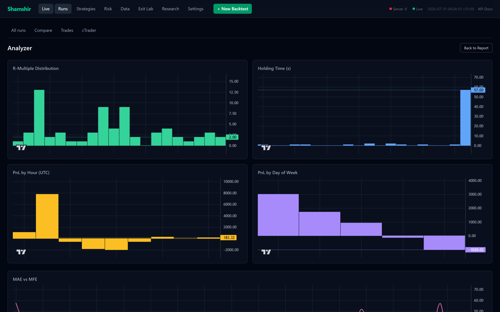
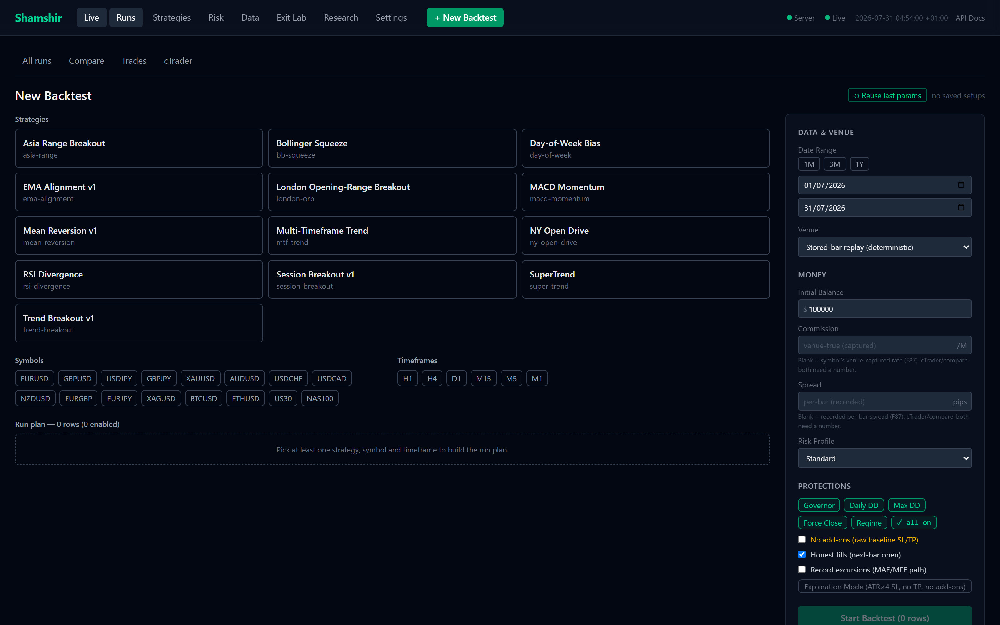
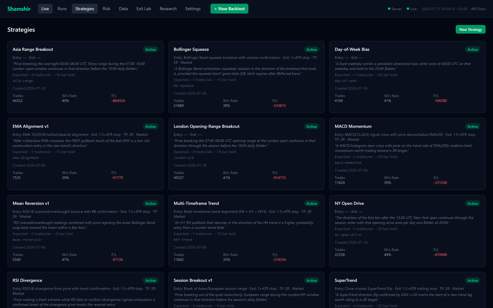
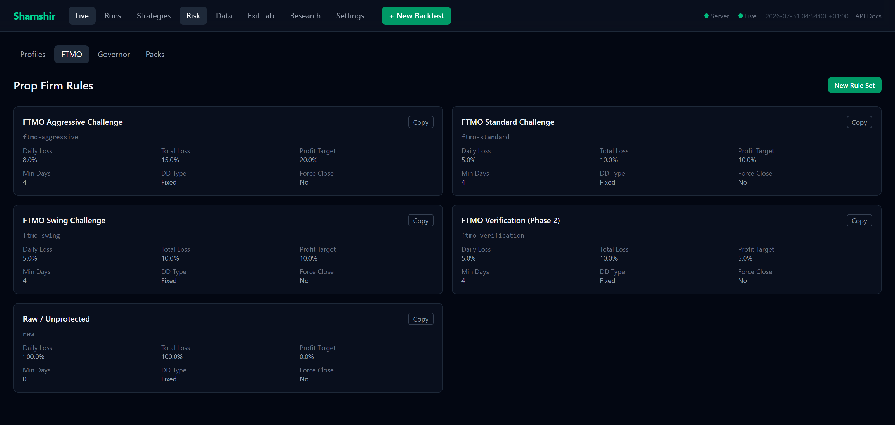

# Shamshir

**A deterministic, event-sourced trading engine — the same decision kernel drives backtest, replay, and live execution.**

Re-run the same data, config, and seed and you get a byte-identical result. That single property is
what makes replay, audit, and trustworthy tests possible, and it shapes every design decision below.

<sub>.NET 10 · C# 13 · Angular 19 · EF Core + SQLite · cTrader over NetMQ</sub>



---

## Contents

- [Architecture](#architecture)
- [Determinism](#determinism)
- [Venues](#venues)
- [Screenshots](#screenshots)
- [Web stack](#web-stack)
- [Research tooling](#research-tooling)
- [Tech stack](#tech-stack)
- [Repository layout](#repository-layout)
- [Quick start](#quick-start)
- [Testing](#testing)
- [Project status](#project-status)

---

## Architecture

### The kernel funnel

Everything flows through a single pump:

> **an event happens → a pure function decides → it returns (new state, a list of effects) → a thin
> shell performs the effects → the venue's response comes back as new events.**

- The **decision core is pure** — no clocks, no randomness, no database, no I/O. Same inputs, same
  outputs. This is *functional core / imperative shell*: a reducer `(state, event) → (state', effects)`,
  the same shape as an Elm/Redux update function, plus effects.
- **Effects are descriptions, not actions.** The core returns `SubmitOrder`, `ModifyPosition`,
  `ClosePosition` as data. A separate executor is the only component that touches the outside world.
- **State is one object.** `EngineState` is the single source of truth for positions, drawdown,
  protection, governor, and account. There is no second copy anywhere — a duplicated, drifting
  state copy is what killed the previous design.
- **Time is a parameter, not an ambient read.** Simulated time is passed into the reducer as data,
  so a replay at 10,000× speed and a live session take the identical code path.

### Life of a bar

```
bar arrives
  → indicators → regime classification → strategies → signal gate     (BarEvaluator)
  → position sizing → risk rules → governor veto                      (Risk engine)
  → effects: submit / modify / close                                  (Executor)
  → venue response → new events → state transition                    (Kernel)
  → every step appended to one auditable journal
```

The risk layer sits *in* the decision path rather than in a report generated afterwards: sizing,
the drawdown governor, and the configurable rule sets (daily loss, total loss, profit target,
minimum trading days, fixed vs trailing drawdown) can veto or resize an order before it is emitted.

### Layering

`Domain` is pure C# with zero infrastructure references, and an architecture test suite enforces
that — along with rules like "the engine may not reference `ILogger` or EF types" and "every
persisted entity implements `IAuditableEntity`". The dependency rule is checked by tests, not by
convention.

## Determinism

Determinism is a tested property, not an aspiration:

- The reducer is pure, so a given `(state, event)` always yields the same `(state', effects)`.
- Events arrive in one fixed, total order.
- Fill semantics are explicit and documented — resting orders fill at the first breaching M1
  tick (`docs/reference/RESTING-ORDER-CONTRACT.md`), not at an idealised price.
- Costs are resolved through a single spread resolver shared by fills, floating PnL, and the
  strategy tick, so no two code paths can disagree about what a trade cost. Spread comes from the
  recorded per-bar value and commission from the venue's captured rate.
- Re-running a scored batch regenerates byte-identical output; that check is part of the workflow.

The payoff is that a bug reproduces exactly, a run can be replayed years later, and the
simulation tier can assert on precise numbers instead of tolerances.

## Venues

| Venue | What it is | Used for |
|-------|-----------|----------|
| **Stored-bar replay** | Deterministic replay from the bar database | Reproducible runs, CI |
| **Fast tape** | In-process replay with measured cTrader-parity fill semantics | Large batch sweeps |
| **cTrader** | The real venue over NetMQ, via a compiled cBot | Parity verification, forward tests |

The same kernel drives all three — only the data source and the executor's transport change.

**cTrader integration.** A cBot (constrained to C# 6 by the cTrader host) runs inside the platform
and speaks to the engine over NetMQ. Parity is established by reconciling the venue's *own* report
against the engine's ledger rather than by modelling what the venue should have done — the venue is
made to tell us what it did. A dedicated end-to-end tier drives the real compiled cBot under the
cTrader CLI and diffs the two ledgers.

## Screenshots

<table>
<tr>
<td width="50%"><br><sub><b>Run list</b> — every run is an isolated account with its own ledger, filterable and comparable.</sub></td>
<td width="50%"><br><sub><b>Analyzer</b> — R-multiple distribution, holding time, PnL by hour and weekday, MAE vs MFE.</sub></td>
</tr>
<tr>
<td width="50%"><br><sub><b>Run builder</b> — strategy × symbol × timeframe run plan, venue-true costs, protection toggles.</sub></td>
<td width="50%"><br><sub><b>Strategy bank</b> — 13 families, each declaring its entry/exit contract and expected frequency.</sub></td>
</tr>
</table>


<sub><b>Risk rule sets</b> — daily loss, total loss, profit target, minimum days, drawdown type; evaluated inside the decision path.</sub>

## Web stack

One ASP.NET Core process serves everything on a single origin: the built Angular SPA from
`wwwroot`, the REST API under `/api`, a Scalar API explorer at `/scalar/v1`, and a SignalR hub for
live run telemetry.

- **Angular 19** — standalone components, signals for state, lazy-loaded feature routes.
- **Live updates** — SignalR plus SSE stream run progress, equity, and journal entries while a run
  executes; the UI is push-driven rather than polled.
- **Charts** — Lightweight Charts for equity, drawdown, and per-trade candle context.
- **Styling** — Tailwind 4.

The .NET build rebuilds the SPA into `wwwroot` when it is stale, so `dotnet run` is the whole
workflow; `ng serve` with a proxy is available as a separate launch profile for frontend work.

## Research tooling

A Python layer sits alongside the engine for batch analysis:

- **`block_bootstrap.py`** — stationary block bootstrap over pooled daily PnL, producing confidence
  intervals and P(Δ>0) rather than point estimates.
- **`split_half.py`**, **`regime_conditioning.py`** — robustness and conditioning checks.
- **`cost_decomposition.py`** — separates gross PnL, spread, commission, and swap per trade.
- **Census drivers** — orchestrate large parameter sweeps against the engine's CLI, with
  idempotent run namespacing so an interrupted batch resumes without duplicating work.

Experiment specifications are persisted in the database alongside their results, so a run's exact
configuration is recoverable from the record rather than from a script that has since changed.

## Tech stack

| Layer | Choice |
|-------|--------|
| **Runtime** | .NET 10, C# 13 |
| **Domain** | Pure C#, zero infrastructure dependencies |
| **Persistence** | EF Core + SQLite (WAL), money stored exactly |
| **Indicators** | Skender.Stock.Indicators |
| **Venue** | cTrader Open API via a compiled cBot over NetMQ |
| **Web API** | ASP.NET Core, Scalar API explorer, SignalR + SSE |
| **Frontend** | Angular 19 (standalone, signals), Tailwind 4, Lightweight Charts |
| **Analysis** | Python — bootstrap statistics, sweep drivers, cost decomposition |
| **Logging** | Serilog |
| **Testing** | xUnit, FluentAssertions, NSubstitute, Jest, Playwright |

## Repository layout

```
src/
  TradingEngine.Domain/           # Pure domain — zero infra deps
  TradingEngine.Engine/           # The decision kernel (reducer + effects)
  TradingEngine.Risk/             # Sizing, drawdown governor, rule sets
  TradingEngine.Strategies/       # 13 strategy families
  TradingEngine.Services/         # Pip math, SL/TP, trailing, entry planning, costs
  TradingEngine.Infrastructure/   # EF Core, adapters, persistence
  TradingEngine.Experiments/      # Experiment specs, scoring, records
  TradingEngine.Host/             # Engine worker + DI wiring
  TradingEngine.Web/              # REST API, SignalR hub, serves the SPA
  TradingEngine.Adapters.CTrader/ # The cBot (C# 6, cTrader-hosted)
  TradingEngine.CTraderRunner/    # Headless cTrader session driver
  TradingEngine.ResearchCli/      # Batch sweep command line
web-ui/                           # Angular 19 SPA
tools/research/                   # Python statistics + sweep drivers
docs/reference/                   # Normative architecture docs
```

Roughly **47k lines of hand-written C#** (excluding generated EF migrations) across 13 projects,
plus ~11k lines of TypeScript/HTML.

> This repo is itself driven by [Conductor](https://github.com/shaahink/conductor). `conductor-DEBT.md`
> (open debt tracked across iterations, see [`AGENTS.md`](AGENTS.md)), `conductor.plan.json`, and
> `conductor-structural-edge.plan.json` sit at the repo root because that's the `tracker`/default-plan
> path Conductor reads from — not stray output.

## Quick start

```powershell
# Build everything (the .NET build also builds the Angular SPA into wwwroot)
dotnet build

# Run the web app — API + SPA + API explorer on one origin
dotnet run --project src/TradingEngine.Web
#   SPA           → http://localhost:5134
#   API explorer  → http://localhost:5134/scalar/v1
```

From there: **Data** to download market data, **New Backtest** to build a run plan
(strategy × symbol × timeframe), then **Runs** for the report, analyzer, and trade gallery.

The backtest and replay paths are credential-free. Live cTrader sessions additionally need
credentials in user-secrets.

## Testing

**1,167 tests** across four tiers, all credential-free except the cTrader end-to-end suite:

| Tier | Tests | What it covers |
|------|------:|----------------|
| Unit | 834 | Domain, risk math, sizing, indicators, kernel reducers |
| Integration | 161 | Persistence, API surface, adapters end-to-end |
| Simulation | 164 | Full replay runs — rule semantics, determinism, fill parity |
| Architecture | 8 | Layering and purity rules, enforced as tests |

```powershell
dotnet test tests/TradingEngine.Tests.Unit           # fastest signal (~5s)
dotnet test tests/TradingEngine.Tests.Simulation     # replay + rule semantics
cd web-ui && npm test                                # Angular unit tests (Jest)
```

The cTrader end-to-end suite drives the real compiled cBot under the cTrader CLI and reconciles the
venue's own report against the engine's ledger. It skips automatically without credentials.

## Project status

Active personal project. The engine, risk system, web application, and analysis tooling are built
and tested. Two architecture tests currently fail on known drift — a `DateTime` parameter on
`EngineReducer.ReconcileToVenue` and a missing `IAuditableEntity` on one entity — both tracked
rather than suppressed, which is the point of having that tier.

Design decisions are recorded in [`DECISIONS.md`](DECISIONS.md); each iteration keeps a plan,
ledger, and handover under [`docs/iterations/`](docs/iterations/).

### Reference documents

| Document | What |
|----------|------|
| [`docs/reference/SYSTEM-IN-PLAIN-WORDS.md`](docs/reference/SYSTEM-IN-PLAIN-WORDS.md) | Plain-English mental model — start here |
| [`docs/reference/SYSTEM-REFERENCE.md`](docs/reference/SYSTEM-REFERENCE.md) | System overview and detailed reference |
| [`docs/reference/CODE-MAP.md`](docs/reference/CODE-MAP.md) | Feature → file index and process walkthroughs |
| [`docs/reference/BACKTEST-ARCHITECTURE.md`](docs/reference/BACKTEST-ARCHITECTURE.md) | How backtesting works across both venue paths |
| [`docs/reference/RESTING-ORDER-CONTRACT.md`](docs/reference/RESTING-ORDER-CONTRACT.md) | Exact fill semantics for resting orders |
| [`docs/reference/INVESTIGATION-METHOD.md`](docs/reference/INVESTIGATION-METHOD.md) | How venue/parity claims get verified (normative) |
| [`docs/reference/TEST-ARCHITECTURE.md`](docs/reference/TEST-ARCHITECTURE.md) | Test tiers, harnesses, cTrader vs mock |
| [`AGENTS.md`](AGENTS.md) | Contributor session startup and reading order |

---

<sub>© 2026 Shahin Kiassat. All rights reserved. Published for portfolio and reference purposes; no licence is granted for reuse.</sub>
